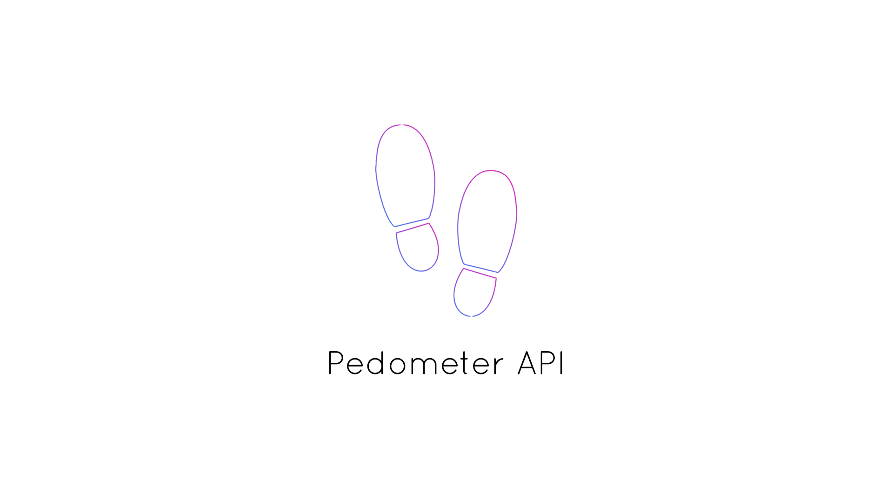

# Pedometer API


Pedometer is a native pedometer API for the Unity game engine. The API provides sensor information about step count and distance covered (in meters). It is a minimalist API with native backends on iOS and Android. There is also a backend that uses GPS in the case that a hardware pedometer is not available for use. Download the unitypackage [here](https://www.dropbox.com/s/ozau2zutlijnf5w/Pedometer1.0b1.unitypackage?dl=1).

## Pedometer
To use the API, simply create a `Pedometer` instance:
```csharp
// Create a pedometer
// The OnStep callback will be invoked each time a step is detected
var pedometer = new Pedometer(OnStep);

void OnStep (int steps, double distance) {
    // Display the values
    stepText.text = steps.ToString();
    // Display distance in feet
    distanceText.text = (distance * 3.28084).ToString("F2") + " ft";
}
```

When you are done detecting steps from a `Pedometer` instance, you must dispose it:
```csharp
// Dispose of this pedometer instance
pedometer.Dispose();
```

Because the API uses native resources, you may wish to release these resources (like stopping the step sensor to save power). To do so, use the `Release` function:
```csharp
// Release Pedometer's native resources
Pedometer.Release();
```

## Architecture
The Pedometer API is modeled after the NatCam API, comprising of a unified front end and several platform-specific backend implementations. Each backend implementation must implement the `IPedometer` interface. These backend implementations are responsible for managing native resources and sensor events. On Android, Pedometer uses `SensorManager` whereas on iOS, Pedometer uses `CMPedometer`.

## Modifications
To make modifications, simply edit the sources in Pedometer>Plugins. The `Android` directory contains the Android source, a Makefile, and an AndroidManifest.xml (which must not be renamed or moved). To build your Android changes, modify the Makefile with paths specific to your installations then run `make` in the `Android` directory. The java source will be compiled into a .jar which will be included in the application binary.

On iOS, simply make changes you want. No need to build anything; the Unity build process will copy the Objective-C++ sources to the XCode project.

Please contribute your changes back to the repository! Since Pedometer is open source, its development must be driven by the community.

## Credits
- [Yusuf Olokoba](mailto:olokobayusuf@gmail.com)